# 03. System Architecture

---

### 1. Architectural Model

MaxiDOM is built on a **Client-Server** architecture. This model cleanly separates the responsibilities of data collection (client) from data processing and machine learning (server).

-   **Client (Frontend)**: A lightweight **Chrome Extension** that acts as a distributed sensor, deployed on the end-user's browser.
-   **Server (Backend)**: A centralized **FastAPI Application** that serves as the system's brain, handling all computation and state management.

### 2. Component Breakdown

#### 2.1. Chrome Extension

The extension is responsible for capturing user behavior without impacting performance. Its duties are strictly limited to:

-   **Data Collection**: Using DOM event listeners (`mousemove`, `keydown`, `wheel`, etc.) to capture raw interaction data.
-   **Data Aggregation**: Structuring raw events into a clean, aggregated JSON payload. This involves grouping mouse movements into paths and pairing key-down/key-up events.
-   **Session Management**: Buffering aggregated data and transmitting it to the backend every 30 seconds of activity.
-   **Receiving Feedback**: Listening for responses from the backend (e.g., an anomaly score) and triggering UI alerts if necessary.

#### 2.2. FastAPI Backend

The backend handles all the heavy lifting, ensuring the client remains lightweight. Its responsibilities include:

-   **API Endpoints**: Providing clear RESTful endpoints for receiving data (`/score`, `/train`).
-   **User Identity Management**: Associating incoming data with a specific user profile via a unique `UUID`.
-   **Feature Extraction**: Parsing the aggregated JSON payload and converting it into a fixed-size numerical feature vector suitable for the machine learning model.
-   **Model Lifecycle Management**:
    -   **Training**: Orchestrating the training of new `Isolation Forest` models during the profiling phase.
    -   **Scoring**: Loading the appropriate user model and using it to score new data for anomaly detection.
    -   **Retraining**: Implementing the logic for the periodic retraining feedback loop.
-   **Persistence**: Saving and loading trained Scikit-learn models from the file system (as `.joblib` files), with each model file named after its corresponding `UUID`.

### 3. Data Flow

The system follows two primary data flows: **Profiling/Training** and **Detection**.

#### 3.1. Profiling & Training Flow

1.  A new user generates a `UUID`.
2.  The **Chrome Extension** collects and aggregates behavioral data.
3.  The extension sends the data to a training-specific endpoint (e.g., `/train`).
4.  The **Backend** receives the data, performs feature extraction, and stores the feature vectors.
5.  Once enough data is collected (cold start period ends), the backend trains a new `Isolation Forest` model.
6.  The trained model is serialized and saved to disk, named with the user's `UUID` (e.g., `models/b3d1c2a-....joblib`).
7.  The user's state is switched from "profiling" to "detection."

#### 3.2. Detection Flow

1.  An existing user with a trained model interacts with their browser.
2.  The **Chrome Extension** collects and aggregates data.
3.  The extension sends the data payload to the detection endpoint (e.g., `/score`).
4.  The **Backend** receives the payload and performs the same feature extraction process.
5.  It loads the user's specific model from disk using their `UUID`.
6.  It scores the new feature vector against the model.
7.  It returns a JSON response indicating whether the behavior is an anomaly (e.g., `{"is_anomaly": true}`).
8.  The **Chrome Extension** receives the response and can display a warning to the user if an anomaly is detected.

---

### 4. Visualization

The following diagram illustrates the complete architectural flow:

```mermaid
graph LR
    subgraph "Chrome Browser (Client)"
        direction LR
        User(👤 User) -- "Interacts (Mouse, Keys, Scroll)" --> ContentScript[Content Script]
        ContentScript -- "Raw Events" --> BackgroundScript[Background Script]
        BackgroundScript -- "Aggregates Data (JSON)" --> BackgroundScript
    end

    subgraph "FastAPI Backend (Server)"
        direction TB
        API[API Endpoints<br>/score, /train]
        FeatureExtractor[Feature Extraction Engine]
        ModelManager[ML Model Manager]
        
        API --> FeatureExtractor
        FeatureExtractor --> ModelManager
    end

    subgraph "Persistence"
        ModelStorage[(<br>Trained Models<br>./models/uuid.joblib)]
    end

    BackgroundScript -- "POST /score or /train<br>(Aggregated JSON)" --> API
    API -- "JSON Response<br>{'is_anomaly': ...}" --> BackgroundScript

    ModelManager -- "Loads Model" --> ModelStorage
    ModelManager -- "Saves Model" --> ModelStorage

    style User fill:#d6eaff,stroke:#333
    style ModelStorage fill:#f5e6cc,stroke:#333

```

