# 03. System Architecture

---

### 1. Architectural Model

MaxiDOM is built on a decoupled **Client-Server** architecture. This separation ensures that complex biometric processing is isolated from the browser environment, maintaining performance and security.

-   **Client (Frontend)**: A **Chrome Extension** (Manifest V3) acting as an intelligent sensor and enforcement agent.
-   **Server (Backend)**: A **FastAPI** application acting as the biometric decision engine.

### 2. Component Breakdown

#### 2.1. Chrome Extension (The Sensor & Enforcer)

The extension is responsible for capturing micro-behaviors and enforcing security protocols.

-   **Hybrid Data Collector**: Uses a sophisticated "Event-Driven + Inactivity" logic. Data is batched and sent only when a "session" completes (defined by 5 seconds of inactivity, 90 seconds max duration, or 2000 events).
-   **Noise Filtering**: The frontend discards sessions with fewer than 20 events locally, preventing network congestion and server noise.
-   **Lockdown Enforcer**: Utilizes `chrome.storage.local` to persist authentication state. On browser startup, it defaults to "Locked" and injects a blocking overlay until the user authenticates.
-   **Active Responder**: Listens for anomaly flags from the backend and triggers the **Step-Up Authentication** (password prompt) flow.

#### 2.2. FastAPI Backend (The Decision Engine)

The backend handles the mathematical heavy lifting and "Dissect and Score" logic.

-   **Specialist Orchestrator**: Unlike traditional systems that use a single model, the backend manages two distinct `IsolationForest` models per user:
    1.  **Mouse Specialist**: Analyzes motor control and path dynamics.
    2.  **Typing Specialist**: Analyzes rhythm and digraph flight times.
-   **Significance Gating**: Before scoring, the backend checks data density. If a session has insufficient data for a specific modality (e.g., < 6 keystrokes), that specific model "abstains" from voting to prevent false positives.
-   **Static Security Lifecycle**: The backend enforces a "Train Once, Protect Forever" policy. It refuses to update models based on unverified detection data to prevent "Adversarial Model Poisoning."

### 3. Data Flow

The system follows two distinct operational flows based on the user's lifecycle state.

#### 3.1. Enrollment & Profiling Flow (The "Pristine" Phase)

1.  **Lockdown**: The user opens the browser. The extension blocks access (`overlayState = true`) until the user enters their password.
2.  **Collection**: Once unlocked, the extension captures high-fidelity behavioral data.
3.  **Transmission**: Data is sent to `POST /api/train/{uuid}`.
4.  **Vectorization**: The backend extracts a 15-dimensional feature vector.
5.  **Diversity Check**: The backend monitors the "Diversity Pool" (total samples, mouse-heavy samples, keyboard-heavy samples).
6.  **Training**: Once thresholds (300 samples) are met, the backend trains the two Specialist Models and saves them to disk. The system state advances to "Detection."

#### 3.2. Detection & Verification Flow (The "Active" Phase)

1.  **Activity**: The user interacts with a webpage.
2.  **Dissection**: The extension sends the payload to `POST /api/score/{uuid}`. The backend dissects the payload into mouse and keyboard components.
3.  **Gating & Scoring**:
    *   **Typing Model**: Scores only if `key_count >= 6`.
    *   **Mouse Model**: Scores only if `mouse_points >= 30`.
4.  **The "Weakest Link" Decision**:
    *   If **EITHER** active model returns a score below the 15th percentile threshold, the session is flagged as an **Anomaly**.
    *   If both pass (or one passes and the other abstains), the session is **Normal**.
5.  **Response**:
    *   **Normal**: API returns `{"is_anomaly": false}`. No action taken.
    *   **Anomaly**: API returns `{"is_anomaly": true}`.
6.  **Enforcement**: The extension receives the flag and immediately re-injects the **Password Overlay**, locking the browser session until identity is re-verified.

---

### 4. Visualization

The following diagram illustrates the "Dissect and Score" architecture.

```mermaid
graph TD
    subgraph "Chrome Extension"
        User(👤 User Activity) --> Collector[Hybrid Collector]
        Collector -- "Aggregated JSON" --> API_Client
    end

    subgraph "FastAPI Backend"
        API_Client -- "POST /score" --> Dissector[Feature Extraction & Dissection]
        
        Dissector -- "Mouse Features" --> GateM{Count > 30?}
        Dissector -- "Typing Features" --> GateK{Count > 6?}
        
        GateM -- "Yes" --> ModelM[🐭 Mouse Specialist Model]
        GateM -- "No" --> AbstainM[Abstain - Safe]
        
        GateK -- "Yes" --> ModelK[⌨️ Typing Specialist Model]
        GateK -- "No" --> AbstainK[Abstain - Safe]
        
        ModelM --> ScoreM[Mouse Score]
        ModelK --> ScoreK[Typing Score]
        
        ScoreM & ScoreK --> Logic{Is EITHER Score < Threshold?}
        
        Logic -- "Yes" --> Response[Anomaly Detected!]
        Logic -- "No" --> ResponseOK[Normal Behavior]
    end

    Response -- "Lock Interface" --> User
```

