# 03. System Architecture

---

### 1. Architectural Model

MaxiDOM is built on a **Client-Server** architecture. This model cleanly separates the responsibilities of data collection (client) from data processing and machine learning (server).

-   **Client (Frontend)**: A lightweight **Chrome Extension** that acts as a distributed sensor, deployed on the end-user's browser.
-   **Server (Backend)**: A centralized **FastAPI Application** that serves as the system's brain, handling all computation and state management.

### 2. Component Breakdown

#### 2.1. Chrome Extension (The Sensor & Responder)

The extension is responsible for capturing user behavior and responding to backend commands. Its duties include:

-   **Data Collection**: Using DOM event listeners (`mousemove`, `keydown`, `wheel`, etc.) to capture raw interaction data.
-   **Data Aggregation**: Structuring raw events into a clean, aggregated JSON payload.
-   **Session Management**: Transmitting data to the backend every 30 seconds of activity.
-   **Secure Communication**: Sending payloads via HTTPS POST requests to the backend API.
-   **Active Response**: When an anomaly is detected, the extension is responsible for **injecting an overlay** to prompt the user for their password and sending the input to the backend for verification.

#### 2.2. FastAPI Backend (The Brain)

The backend handles all the heavy lifting, ensuring the client remains lightweight. Its responsibilities include:

-   **API Endpoints**: Providing clear RESTful endpoints for receiving data (`/score`, `/train`) and handling active verification (`/verify_password`).
-   **User Identity Management**: Associating incoming data with a specific user profile via a unique `UUID`.
-   **Secure Credential Storage**: Hashing and storing user passwords securely using a strong algorithm like bcrypt.
-   **Feature Extraction**: Parsing the aggregated JSON payload and converting it into a numerical feature vector.
-   **Model Lifecycle Management**:
    -   **Training**: Orchestrating the training of new `Isolation Forest` models.
    -   **Scoring**: Loading the appropriate user model and using it to score new data.
    -   **Retraining**: Implementing the logic for the periodic retraining feedback loop.
-   **Persistence**: Saving and loading trained models from the file system.

### 3. Data Flow

The system follows two primary data flows: **Profiling/Training** and **Detection**.

#### 3.1. Profiling & Training Flow

1.  A new user enrolls by setting a password and generates a `UUID`.
2.  The **Chrome Extension** collects and aggregates behavioral data.
3.  The extension sends the data to a training-specific endpoint (e.g., `/train`).
4.  The **Backend** receives the data, performs feature extraction, and stores the feature vectors.
5.  Once enough data is collected, the backend trains a new `Isolation Forest` model.
6.  The trained model is serialized and saved to disk.
7.  The user's state is switched from "profiling" to "detection."

#### 3.2. Detection & Verification Flow

1.  An existing user interacts with their browser.
2.  The **Chrome Extension** sends the data payload to the detection endpoint (`/score`).
3.  The **Backend** scores the data.
4.  **If the behavior is normal**, the backend saves the data to the retraining pool (this is the feedback loop) and sends a normal response.
5.  **If the behavior is an anomaly**, the backend returns `{"is_anomaly": true}`.
6.  The **Chrome Extension** receives the anomaly flag and injects a password prompt overlay.
7.  The user enters their password. The extension sends it to the `POST /verify_password` endpoint.
8.  The **Backend** verifies the password against the stored hash and returns `{"verified": true/false}`.
9.  The **Chrome Extension** removes the overlay on success or shows an error on failure.

---

### 4. Visualization

The following diagram illustrates the complete architectural flow, including the new verification step.

```mermaid
graph LR
    subgraph "Chrome Browser (Client)"
        direction LR
        User(👤 User) -- "Interacts" --> ContentScript[Content Script]
        ContentScript -- "Raw Events" --> BackgroundScript[Background Script]
        BackgroundScript -- "Aggregates Data (JSON)" --> BackgroundScript
    end

    subgraph "FastAPI Backend (Server)"
        direction TB
        API[API Endpoints<br>/score, /train, /verify_password]
        FeatureExtractor[Feature Extraction Engine]
        ModelManager[ML Model Manager]
        AuthManager[Auth & Password Manager]
        
        API -- "/score, /train" --> FeatureExtractor
        FeatureExtractor --> ModelManager
        API -- "/verify_password" --> AuthManager
    end

    subgraph "Persistence"
        ModelStorage[(Trained Models)]
        UserDB[(User Credentials<br>Hashed Passwords)]
    end

    BackgroundScript -- "POST /score or /train" --> API
    API -- "JSON Response" --> BackgroundScript

    ModelManager -- "Loads/Saves Model" --> ModelStorage
    AuthManager -- "Loads/Saves Hash" --> UserDB

    User -- "Enters Password" --> BackgroundScript
    BackgroundScript -- "POST /verify_password" --> API
```

