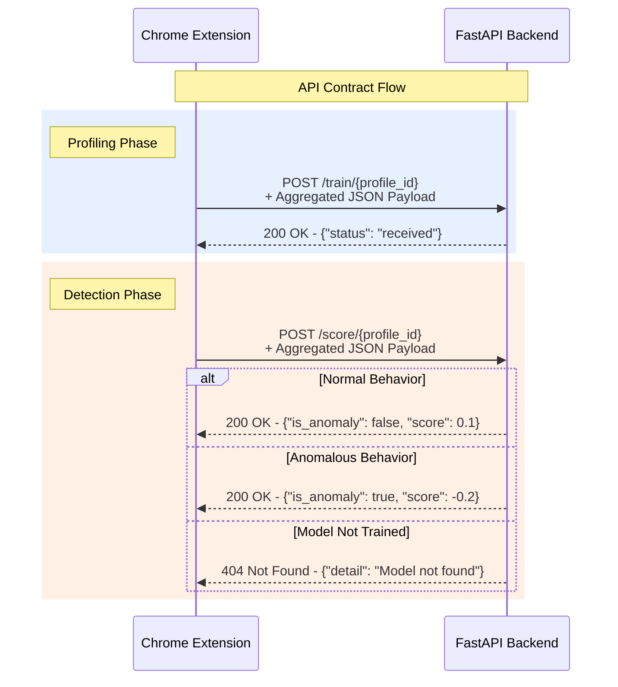

# 04. API Contract

This document defines the RESTful API for the MaxiDOM backend. It specifies the endpoints, request payloads, and response formats that govern communication between the Chrome Extension (client) and the FastAPI server.

---

### 1. General Information

-   **Base URL (Development)**: `http://127.0.0.1:8000`
-   **Data Format**: All request and response bodies are in `application/json` format.
-   **Identification**: The client identifies a specific browser profile by including a `profile_id` (UUID) as a URL path parameter in every request.

### 2. Standard Error Response

In case of an error (e.g., 4xx or 5xx status codes), the API will return a JSON object with a `detail` key explaining the error.

```json
{
  "detail": "A descriptive error message."
}
```

---

### 3. Endpoints

#### 3.1. `POST /train/{profile_id}`

Submits a batch of behavioral data to be used for training or retraining an `Isolation Forest` model. This endpoint is used during the initial "profiling" phase.

-   **URL Parameters**:
    -   `profile_id` (string, **required**): The unique identifier for the browser profile.
-   **Request Body**: A JSON object containing the aggregated behavioral data.

```json
// Example Request Body
{
  "startTimestamp": 1678890000000,
  "endTimestamp": 1678890120000,
  "windowSize": { "width": 1920, "height": 1080 },
  "keyEvents": [
    { "code": "KeyH", "downTime": 1678890005100, "upTime": 1678890005185 }
  ],
  "mousePaths": [
    [
      { "t": 1678890010500, "x": 850, "y": 420 },
      { "t": 1678890010520, "x": 855, "y": 425 }
    ]
  ],
  "clicks": [
    { "t": 1678890015300, "x": 1500, "y": 250, "duration": 125 }
  ],
  "scrollEvents": [
    { "t": 1678890020100, "dy": 100 }
  ],
  "focusChanges": [
    { "type": "blur", "t": 1678890030000 }
  ]
}
```

-   **Success Response (`200 OK`)**:
    -   Indicates the data was received and accepted for the training pool.

```
{
  "status": "training data received",
  "profile_id": "b3d1c2a-e1f2-4a5b-8c6d-9e0f1a2b3c4d"
}
```


-   **Error Responses**:
    -   `422 Unprocessable Entity`: The request body is malformed or fails validation (e.g., wrong data types).

---

#### 3.2. `POST /score/{profile_id}`

Submits a batch of behavioral data to be scored against the profile's pre-trained model for anomaly detection. This is the primary endpoint used during the "detection" phase.

-   **URL Parameters**:
    -   `profile_id` (string, **required**): The unique identifier for the browser profile.
-   **Request Body**: The request body structure is **identical** to the `/train` endpoint.

-   **Success Response (`200 OK`)**:
    -   Returns a boolean `is_anomaly` flag and the raw anomaly score from the `Isolation Forest` model. A negative score is more likely to be an anomaly.

```jso
// Example Response (Normal Behavior)
{
  "is_anomaly": false,
  "score": 0.085
}

// Example Response (Anomalous Behavior)
{
  "is_anomaly": true,
  "score": -0.112
}
```


-   **Error Responses**:
    -   `404 Not Found`: No trained model exists for the provided `profile_id`. The client should remain in the profiling phase.
    -   `422 Unprocessable Entity`: The request body is malformed or fails validation.

### 4. Implicit Model Retraining (Feedback Loop)

There is **no dedicated `/retrain` endpoint**. This is a deliberate design choice to simplify client logic and centralize the model lifecycle on the backend.

The retraining process is handled implicitly by the backend:

1. The client sends data to the /score endpoint.
    
2. The backend scores the data.
    
3. If the data is classified as **normal** `("is_anomaly": false)`, the backend saves the corresponding feature vector to a "retraining candidate pool."
    
4. The backend has an internal policy (e.g., time-based or count-based) that automatically triggers a retraining job using the fresh data from this pool.
    
5. This design **decouples the client from the ML strategy**. The backend's retraining logic can be updated at any time without requiring any changes to the Chrome Extension.


