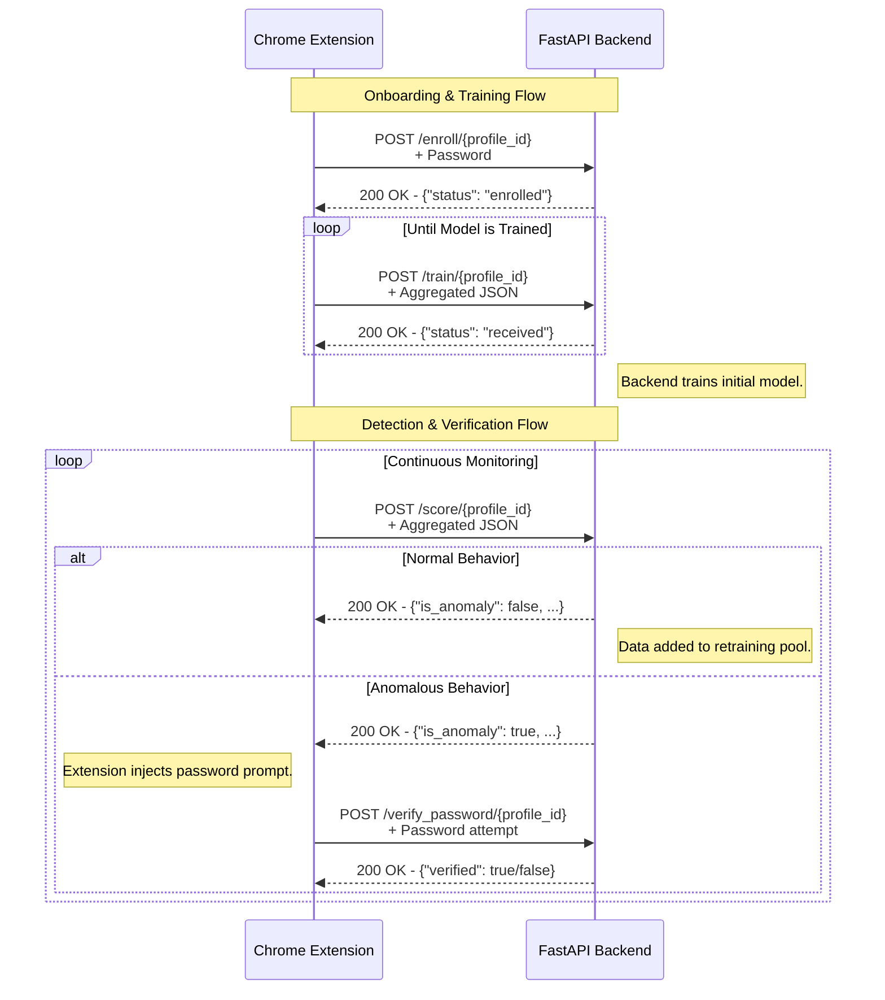

# 04. API Contract

This document defines the RESTful API for the MaxiDOM backend. It specifies the endpoints, request payloads, and response formats that govern communication between the Chrome Extension (client) and the FastAPI server.

The API is designed to be lean, centralizing all model lifecycle logic on the backend. The client's role is strictly limited to sending behavioral data based on its current state (profiling or detecting).

---

### 1. General Information

-   **Base URL (Development)**: `http://127.0.0.1:8000`
-   **Data Format**: All request and response bodies are in `application/json` format.
-   **Identification**: The client identifies a specific browser profile by including a `profile_id` (UUID) as a URL path parameter in every request.

### 2. Standard Error Response

In case of an error (e.g., 4xx or 5xx status codes), the API will return a JSON object with a `detail` key explaining the error.

```json
{
  "detail": "A descriptive error message."
}
```

---

### 3. Endpoints

#### 3.1. `POST /enroll/{profile_id}`

**Purpose**: To enroll a new user by setting their verification password. This is a one-time setup action.

-   **URL Parameters**:
    -   `profile_id` (string, **required**): The unique identifier for the browser profile.
-   **Request Body**:
    ```json
    {
      "password": "the-plain-text-password-to-be-enrolled"
    }
    ```
-   **Success Response (`200 OK`)**:
    ```json
    {
      "status": "enrollment successful",
      "profile_id": "b3d1c2a-e1f2-4a5b-8c6d-9e0f1a2b3c4d"
    }
    ```
-   **Error Responses**:
    -   `409 Conflict`: A password has already been set for this `profile_id`.

#### 3.2. `POST /train/{profile_id}`

**Purpose**: To submit behavioral data during the initial **profiling (cold-start) phase** only.

-   **URL Parameters**:
    -   `profile_id` (string, **required**): The unique identifier for the browser profile.
-   **Request Body**: A JSON object containing the aggregated behavioral data (see `docs/09_DATA_SCHEMA.md` for full structure).
-   **Success Response (`200 OK`)**:
    ```json
    {
      "status": "training data received",
      "profile_id": "b3d1c2a-e1f2-4a5b-8c6d-9e0f1a2b3c4d"
    }
    ```

#### 3.3. `POST /score/{profile_id}`

**Purpose**:
1.  To score behavioral data against a pre-trained model for **real-time anomaly detection**.
2.  To implicitly provide validated data for the **model retraining feedback loop**.

-   **URL Parameters**:
    -   `profile_id` (string, **required**): The unique identifier for the browser profile.
-   **Request Body**: The structure is **identical** to the `/train` endpoint.
-   **Success Response (`200 OK`)**:
    ```json
    // Example Response
    {
      "is_anomaly": true,
      "score": -0.112
    }
    ```
-   **Error Responses**:
    -   `404 Not Found`: No trained model exists for the provided `profile_id`.

#### 3.4. `POST /verify_password/{profile_id}`

**Purpose**: To actively verify the user's identity by checking a password after a behavioral anomaly has been detected.

-   **URL Parameters**:
    -   `profile_id` (string, **required**): The unique identifier for the browser profile.
-   **Request Body**:
    ```json
    {
      "password": "the-plain-text-password-from-user-input"
    }
    ```
-   **Success Response (`200 OK`)**:
    ```json
    {
      "verified": true
    }
    // or
    {
      "verified": false
    }
    ```
-   **Error Responses**:
    -   `404 Not Found`: User profile has no password enrolled.

---

### 5. Visualization

