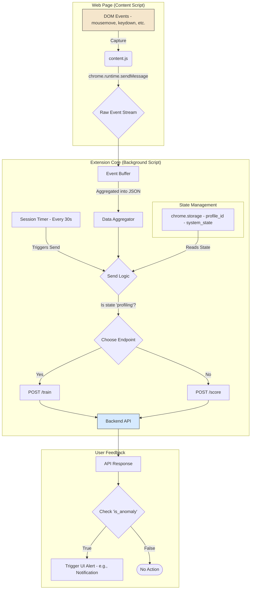

# 05. Frontend: Chrome Extension

---

### 1. Overview

The MaxiDOM Chrome Extension is a lightweight sensor responsible for capturing, aggregating, and transmitting user behavioral data. It is designed to be unobtrusive, operate with minimal performance impact, and function as the primary data source for the backend system.

### 2. Core Components & File Structure

The extension is composed of three main files that work together to perform its duties.

-   **`manifest.json`**
    -   **Purpose**: The extension's configuration file. It defines permissions, specifies which scripts to run, and sets the extension's properties.
    -   **Key Permissions**: `storage` (to persist the user's UUID), `scripting` (to inject content scripts), `tabs` (to monitor activity across tabs), and `notifications` (to display anomaly alerts).

-   **`background.js` (Service Worker)**
    -   **Purpose**: The central nervous system of the extension. It runs persistently in the background.
    -   **Responsibilities**: Manages state (user UUID, profiling vs. detection mode), aggregates data received from content scripts, handles session timing, and communicates with the FastAPI backend.

-   **`content.js`**
    -   **Purpose**: The "eyes and ears" of the extension. This script is injected into every web page the user visits.
    -   **Responsibilities**: Listens for raw DOM events (`mousemove`, `keydown`, etc.) and forwards them to `background.js` for processing. It performs no aggregation itself to remain as lightweight as possible.

### 3. Logic and Workflow

#### 3.1. Initialization and Profile ID

1.  On first installation (`chrome.runtime.onInstalled` event), `background.js` checks `chrome.storage.local` for a `profile_id`.
2.  If no ID exists, it generates a new UUID v4 and saves it to storage. This ID will be used in all future API requests to identify the user's profile.

#### 3.2. Data Capture and Aggregation

1.  **Capture**: The `content.js` script attaches event listeners to the DOM for all relevant behavioral events (mouse, key, scroll, etc.).
2.  **Forwarding**: When an event fires, `content.js` sends the raw event data (e.g., `{type: 'mousemove', t: 167..., x: 100, y: 150}`) to `background.js` using `chrome.runtime.sendMessage`.
3.  **Aggregation**: The `background.js` script listens for these messages. It maintains a central buffer where it performs "lightweight aggregation":
    -   Pairs corresponding `keydown` and `keyup` events into single objects.
    -   Groups sequences of `mousemove` events into distinct "paths".
    -   Calculates click duration by matching `mousedown` and `mouseup`.

#### 3.3. Session Management and Transmission

1.  The `background.js` script manages a session timer.
2.  Data is sent to the backend under one of two conditions:
    -   A fixed time interval of user activity has passed (e.g., 30 seconds).
    -   The internal data buffer reaches a maximum size (e.g., 500 events).
3.  When a send condition is met, the aggregated data buffer is packaged into the JSON format defined in the [API Contract](04_API_CONTRACT.md).
4.  The `fetch` API is used to send a `POST` request to the appropriate backend endpoint (`/train` or `/score`), including the `profile_id` in the URL.
5.  After a successful transmission, the buffer is cleared.

#### 3.4. Anomaly Response

1.  After sending data to the `/score` endpoint, the `background.js` script awaits the JSON response.
2.  If the response contains `{"is_anomaly": true}`, the extension uses the `chrome.notifications.create()` API to display a non-intrusive system notification to the user, warning them of the potential impersonation.

---

### 4. Visualization

This diagram illustrates the internal data flow within the Chrome Extension.

