# 06. Frontend: Chrome Extension

---

### 1. Role and Design Philosophy

The MaxiDOM Chrome Extension is designed as a **lightweight, passive sensor and active responder**. Its primary responsibility is to capture user interaction data with minimal performance impact and to act on commands from the backend.

-   **Lightweight**: It performs only basic data aggregation and avoids heavy computation.
-   **Passive Sensor**: It runs in the background, continuously collecting behavioral data.
-   **Active Responder**: When an anomaly is detected, it actively challenges the user by injecting a password prompt to verify their identity.

### 2. File Structure

The extension is composed of key files that work together to perform its functions.

| File | Role |
| :--- | :--- |
| **`manifest.json`** | **The Blueprint**: Defines the extension's metadata, permissions, and scripts. |
| **`content.js`** | **The Listener & Interactor**: Injected into every webpage. It listens for DOM events and is also responsible for injecting and managing the password overlay UI. |
| **`service_worker.js`** | **The Brain**: The central coordinator. It receives raw events, aggregates them, manages state, and handles all communication with the backend API. |
| **`onboarding.html`** | **The Enrollment Page**: A dedicated page for the one-time user enrollment process, where the verification password is set. |

### 3. Operational Logic

The extension's workflow can be broken down into distinct stages.

#### 3.1. Enrollment (One-Time Setup)

-   Upon first installation, the user is directed to `onboarding.html`.
-   The user sets their verification password.
-   The script in the onboarding page sends the password to `service_worker.js`, which securely transmits it to the `POST /enroll/{profile_id}` endpoint.
-   Once enrollment is successful, the extension's `system_state` is set to `"profiling"`.

#### 3.2. Data Collection (`content.js`)

1. **Capture**: The `content.js` script attaches event listeners to the DOM for all relevant behavioral events (mouse, key, scroll, etc.).
2. **Forwarding**: When an event fires, `content.js` sends the raw event data (e.g., `{type: 'mousemove', t: 167..., x: 100, y: 150}`) to `service_worker.js` using `chrome.runtime.sendMessage`.
3. **Aggregation**: The `service_worker.js` script listens for these messages. It maintains a central buffer where it performs "lightweight aggregation":
    - Pairs corresponding `keydown` and `keyup` events into single objects.
    - Groups sequences of `mousemove` events into distinct "paths".
    - Calculates click duration by matching `mousedown` and `mouseup`.

#### 3.3. Data Aggregation & Backend Communication (`service_worker.js`)

-   The background script buffers and aggregates raw events into the structured JSON payload.
-   A timer triggers the data sending process every 30 seconds of activity.
-   Based on the `system_state` ("profiling" or "detection"), it sends the payload to either the `/train` or `/score` endpoint.
-   It listens for the response from the backend. If the response from `/score` contains `{"is_anomaly": true}`, it initiates the Active Response flow.

### 4. Active Response: The Password Prompt Flow

This flow is triggered when the backend flags an anomaly.

1.  **Initiation (`service_worker.js`)**: The background script receives the anomaly flag and immediately sends a message to the active tab's `content.js` script, instructing it to display the password prompt.
2.  **UI Injection (`content.js`)**: The content script dynamically creates and injects a secure overlay into the current page. This overlay consists of a full-page semi-transparent background and a centered modal with a password input field and a submit button.
3.  **User Input Handling (`content.js` -> `service_worker.js`)**: When the user enters their password and submits the form, the `content.js` script captures the input and sends it back to `service_worker.js`.
4.  **Verification Request (`service_worker.js`)**: The background script receives the password attempt and makes a `fetch` call to the `POST /verify_password/{profile_id}` endpoint.
5.  **Handling the Result (`service_worker.js` -> `content.js`)**: The background script receives the verification result (`{"verified": true/false}`) and relays it to `content.js`.
    -   If `verified` is `true`, the content script removes the overlay from the DOM.
    -   If `verified` is `false`, the content script displays an "Incorrect password" error message within the overlay, allowing the user to try again.

---

### 5. Visualization

The following diagram illustrates the internal data flow within the Chrome Extension, including the anomaly response loop.

```mermaid
graph TD
    subgraph "Data Collection Flow"
        A[DOM Events] --> B(content.js);
        B --> C(service_worker.js);
        C --> D[Aggregates Data];
        D --> E[POST /score or /train];
        E --> F[Backend API];
    end
    
    F --> G{API Response};
    G --> H{is_anomaly == true?};
    
    subgraph "Normal Path"
        H -- "No" --> I([Continue Monitoring]);
    end

    subgraph "Anomaly Response Flow"
        H -- "Yes" --> J[service_worker.js sends<br>message to content.js];
        J --> K[content.js injects<br>Password Overlay];
        L(👤 User enters password) --> K;
        K --> M[content.js sends<br>password to service_worker.js];
        M --> N[service_worker.js sends<br>POST /verify_password];
        N --> F;
        G --> |"Verification response received"| O{Verification Response};
        O -- "True" --> P[content.js removes overlay];
        O -- "False" --> Q[content.js shows error];
    end
```

