# 06. Frontend: Chrome Extension (Manifest V3)

---

### 1. Role and Design Philosophy

The MaxiDOM Chrome Extension acts as an **intelligent, persistent sensor** and **security enforcer**. Unlike traditional "passive" collectors, it manages its own lifecycle state to ensure security survives browser restarts and Service Worker termination.

-   **Intelligent Batching**: It uses a Hybrid Event-Driven model to group interactions into logical "Sessions" rather than fixed time windows.
-   **State Persistence**: It uses `chrome.storage.local` to maintain the "Locked/Unlocked" security state, overcoming the ephemeral nature of Manifest V3 Service Workers.
-   **Active Enforcer**: It physically blocks user interaction via a DOM Overlay when an anomaly is detected or upon browser startup.

### 2. File Structure

| File | Role |
| :--- | :--- |
| **`manifest.json`** | **Configuration**: Defines permissions (`storage`, `scripting`), host permissions, and the service worker entry point. |
| **`script.js`** | **Content Script**: Injected into pages. Captures raw DOM events (`mousemove`, `keydown`) and manages the **Lockdown Overlay** UI. |
| **`service-worker.js`** | **The Controller**: Handles data aggregation, API communication, and state management. Implements the "Time Travel" fix and Session logic. |
| **`utils/helpers.js`** | **State Manager**: Wrappers for `chrome.storage.local` to handle UUIDs, system state (`profiling`/`detection`), and lock status. |
| **`popup.js` / `.html`** | **Dashboard**: Displays profiling progress and manages profile resets/password changes. |
| **`onboarding.js` / `.html`** | **Enrollment**: A standalone full-page tab for the initial password setup. |

---

### 3. Operational Logic

#### 3.1. Enrollment (The "Action Redirect" Pattern)
To ensure a smooth onboarding experience, the extension uses a specific UX pattern:
1.  **State Check**: If the system state is `"enrollment"`, the Service Worker programmatically **disables the popup bubble** (`chrome.action.setPopup({popup: ""})`).
2.  **Click Handler**: It listens for `chrome.action.onClicked`.
3.  **Redirect**: When clicked, it opens (or focuses) `onboarding.html` in a full tab.
4.  **Completion**: Upon successful password registration (`POST /enroll`), the state switches to `"profiling"`, the popup is re-enabled, and the browser session is unlocked.

#### 3.2. The Hybrid Data Collector (`service-worker.js`)
Instead of a simple timer, the collector uses three triggers to define a "Session":
1.  **Inactivity Trigger**: 5 seconds of no user input forces a session flush.
2.  **Safety Net 1 (Duration)**: 90 seconds max duration to prevent massive payloads.
3.  **Safety Net 2 (Capacity)**: 2000 events max to prevent memory overflows.

**Noise Filtering**: Before sending data to the backend, the collector checks if `Total Events > 20`. If not, the data is discarded locally. This prevents "micro-sessions" (e.g., clicking one link) from polluting the training data.

**The "Time Travel" Fix**:
Service Workers can sleep and wake up, causing `performance.now()` to drift or reset. The collector implements a **Causality Check**: it scans all events in the buffer to find the *true* last timestamp and ensures `endTimestamp >= startTimestamp`.

#### 3.3. Lockdown & Persistence (`helpers.js`)
Manifest V3 Service Workers die after ~30 seconds of inactivity. To prevent the extension from "forgetting" that the user unlocked their profile:
-   **Storage**: The `isProfilingUnlocked` flag is stored in **`chrome.storage.local`**.
-   **Browser Startup**: `chrome.runtime.onStartup` explicitly sets this flag to `false` (Locked).
-   **Runtime**: When the Service Worker wakes up, it reads from Storage, not memory.

### 4. Active Response: The Verification Loop

When the Backend returns `{"is_anomaly": true}` or when the browser starts up:

1.  **Broadcast**: `service-worker.js` broadcasts `Action: SHOW_OVERLAY` to all active tabs.
2.  **Injection**: `script.js` creates a Shadow DOM overlay that consumes all mouse/keyboard events (`capture: true`), physically preventing interaction with the web page.
3.  **Verification**:
    -   User enters password in the overlay.
    -   `script.js` sends it to `service-worker.js`.
    -   `service-worker.js` calls `POST /api/verify_password`.
4.  **Resolution**:
    -   **Success**: `service-worker.js` updates `chrome.storage.local` to `unlocked` and broadcasts `HIDE_OVERLAY`.
    -   **Failure**: The overlay displays an error and remains in place.

---

### 5. Data Flow Diagram

```mermaid
graph TD
    User(👤 Interaction) --> Content[script.js]
    Content -- "Raw Events" --> SW[service-worker.js]
    
    subgraph "Service Worker Logic"
        SW --> Buffer[Event Buffer]
        Buffer --> Check{Triggers Met - 5s idle or 90s max}
        Check -- "Yes" --> Filter{Events > 20?}
        Filter -- "Yes" --> Fix[Time Travel Fix]
        Fix --> API[POST /score]
    end
    
    API -- "Anomaly Detected" --> SW
    SW -- "SHOW_OVERLAY" --> Content
    Content -- "Blocks UI" --> User
```

