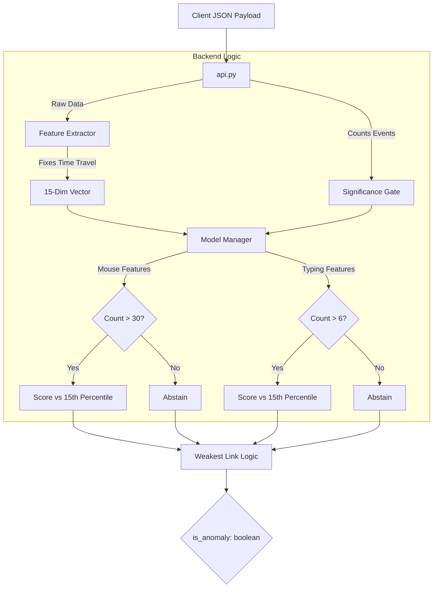

# 07. Backend: FastAPI & Scikit-learn

---

### 1. Role and Design Philosophy

The backend is the **Stateless Decision Engine** of the MaxiDOM system. It centralizes all biometric logic, ensuring that the heavy mathematical lifting (Feature Extraction and ML Inference) happens in a controlled, secure environment rather than on the client device.

-   **Stateless Processing**: Each request is an independent transaction containing all necessary data (Profile UUID + Behavioral Payload).
-   **Specialist Orchestration**: It manages the "Dissect and Score" architecture, routing data to specific models based on the activity type.
-   **High Performance**: Built on **FastAPI** (ASGI) and **Uvicorn**, optimized for concurrent I/O operations.

### 2. Core Components

The backend is modularized to separate API concerns from Biometric concerns.

| Component | File | Responsibility |
| :--- | :--- | :--- |
| **API Layer** | `api.py` | Defines endpoints, validates JSON schemas via Pydantic, and handles HTTP responses. |
| **Feature Engine** | `feature_extraction.py` | Transforms raw JSON into a 15-dimensional vector. **Crucial:** Implements the "Time Travel" fix by deriving duration from event timestamps if the payload metadata is corrupt. |
| **Model Manager** | `utils.py` | Manages the **Specialist Models**. Handles storage/loading of `.joblib` files, implements **Significance Gating**, and calculates the **Dynamic 15th Percentile Threshold**. |
| **Auth Manager** | `database.py`, `security.py` | Handles SQLite interactions for user credentials and bcrypt password hashing. |

### 3. Core Workflows

#### 3.1. Enrollment (`POST /enroll`)
A security-critical, one-time flow.
1.  Receives a plain-text password.
2.  Hashes it using **bcrypt** (Work Factor 12).
3.  Stores the hash in `maxidom.db` linked to the `profile_id`.
4.  **Note:** This endpoint does not trigger ML training; it simply establishes the "Identity Trust Anchor."

#### 3.2. Profiling & Training (`POST /train`)
The system follows a **"Collect, Diversify, Train"** strategy.

1.  **Ingestion**: Receives raw behavioral data.
2.  **Extraction**: Converts data to a 15-dim feature vector immediately (saving storage space).
3.  **Diversity Check**: The Model Manager analyzes the accumulated CSV data. It checks if there are enough samples for *both* modalities:
    *   Total Samples > 300
    *   Keyboard-heavy Samples > 50
    *   Mouse-heavy Samples > 150
4.  **Training Trigger**: Once diversity is met, a Background Task initiates training.
    *   It splits the data into "Mouse" and "Typing" subsets.
    *   It trains two separate **Isolation Forest** models.
    *   It calibrates the **15th Percentile Threshold** for each model independently.

#### 3.3. Scoring (The "Dissect & Score" Logic) (`POST /score`)
This is the heart of the detection engine.

1.  **Validation**: API receives payload and counts raw events (`key_count`, `mouse_count`).
2.  **Dissection**: Feature Extractor produces a unified vector.
3.  **Gating**: The Model Manager applies **Significance Gating**:
    *   If `key_count < 6`: The Typing Model **Abstains** (returns a safe score).
    *   If `mouse_count < 30`: The Mouse Model **Abstains**.
4.  **Inference**:
    *   Valid models run `decision_function()`.
    *   Scores are compared against their specific thresholds.
5.  **Aggregated Decision**:
    *   If **ANY** valid model votes "Anomaly" (Score < Threshold), the session is flagged.
    *   `is_anomaly: true` is returned to the client.

### 4. Visualization

The following diagram illustrates the internal processing pipeline for a Scoring Request.

