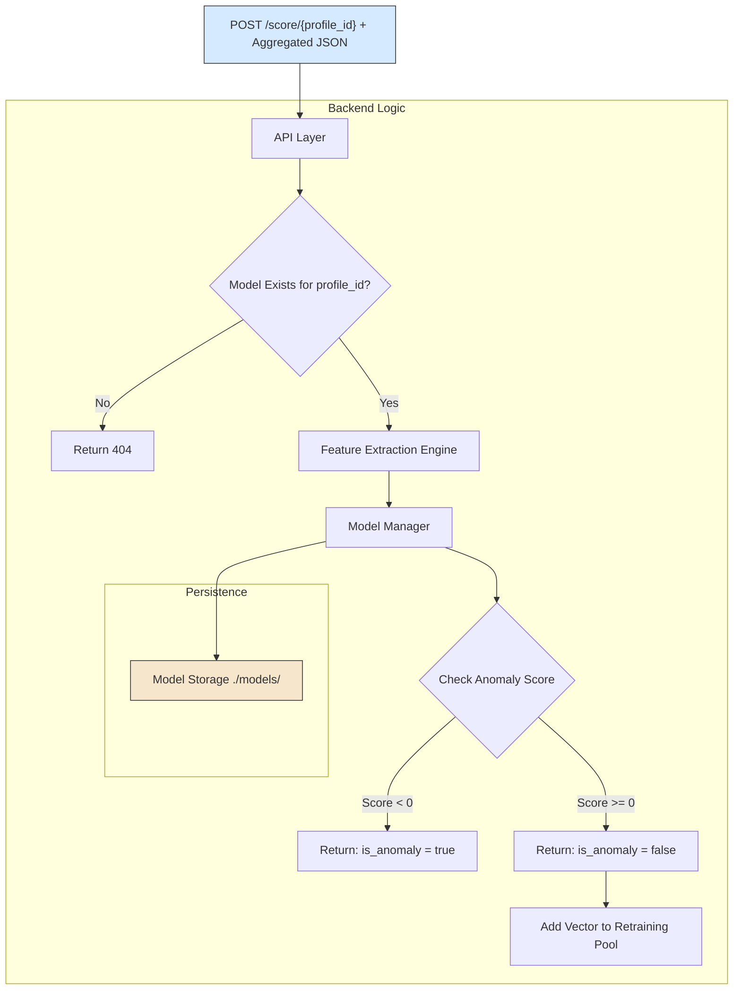

# 07. Backend: FastAPI & Scikit-learn

---

### 1. Role and Design Philosophy

The backend is the **centralized brain** of the MaxiDOM system. It is designed to handle all complex computations, data processing, and machine learning operations, allowing the frontend client to remain lightweight and efficient.

-   **Stateless API**: Each API request is treated as an independent transaction. All necessary state (like the `profile_id`) is provided by the client in the request itself.
-   **Intelligent Server**: It contains all the logic for the model lifecycle, from feature extraction to training, scoring, and periodic retraining.
-   **High Performance**: Built with FastAPI and Uvicorn, it leverages asynchronous capabilities to handle requests efficiently.

### 2. Core Components

The backend codebase is structured into logical modules, each with a distinct responsibility.

| Component / Module | Role | Key Technologies |
| :--- | :--- | :--- |
| **API Layer (`main.py`)** | Defines all RESTful API endpoints (`/train`, `/score`). Manages HTTP requests and responses. Uses Pydantic models for automatic request body validation. | FastAPI, Pydantic |
| **Feature Extractor** | A dedicated module responsible for transforming the aggregated raw JSON payload into a fixed-size, numerical feature vector that can be fed into the ML model. | NumPy, Pandas |
| **Model Manager** | An abstraction layer that handles all interactions with the machine learning models. It manages loading, saving, training, and predicting. | Scikit-learn (`IsolationForest`) |
| **Persistence** | The mechanism for storing and retrieving trained models from the file system. Each model is serialized and named after its corresponding `profile_id`. | `joblib` |

### 3. Core Workflows

The backend processes data according to the endpoint that was called.

#### 3.1. Training Workflow (`POST /train/{profile_id}`)

This flow is executed during the initial profiling phase for a new user.

1.  **Request Validation**: An incoming request to `/train` is received. FastAPI uses Pydantic to automatically validate the JSON body against the predefined schema. If validation fails, a `422` error is returned.
2.  **Feature Extraction**: The valid JSON payload is passed to the **Feature Extractor**, which calculates all statistical features (e.g., `avg_mouse_speed`, `avg_dwell_time`) and returns a single numerical vector.
3.  **Data Pooling**: This feature vector is appended to a temporary data store (e.g., a CSV file or in-memory list) associated with the user's `profile_id`.
4.  **Model Training Trigger**: After a predefined number of data points have been collected (the cold-start period ends), the **Model Manager** is triggered. It trains a new `IsolationForest` model on the entire pool of collected feature vectors.
5.  **Model Persistence**: The newly trained model is serialized using `joblib` and saved to disk (e.g., `./models/{profile_id}.joblib`). The user's state is now considered "active."

#### 3.2. Scoring & Retraining Workflow (`POST /score/{profile_id}`)

This is the standard operational flow for an active user.

1.  **Request Validation**: Same as the training workflow.
2.  **Model Check**: The **Model Manager** checks if a trained model exists for the given `profile_id`. If not, it returns a `404 Not Found` error.
3.  **Feature Extraction**: The JSON payload is converted into a numerical feature vector.
4.  **Scoring**: The **Model Manager** loads the user's model from disk and uses it to score the new feature vector. The `decision_function()` method of `IsolationForest` provides a raw anomaly score.
5.  **Response Generation**: The raw score is used to determine the `is_anomaly` boolean flag (typically, scores `< 0` are anomalous). The final JSON response is sent to the client.
6.  **Implicit Retraining Feedback**: If `is_anomaly` is `false`, the feature vector is considered a valid, recent sample of the user's behavior. It is saved to a "retraining candidate pool" for that user. A background scheduler or counter will periodically trigger a retraining job using these fresh data points, ensuring the model adapts over time.

---

### 4. Visualization

The following diagram illustrates the internal data flow for a request to the `/score` endpoint.
