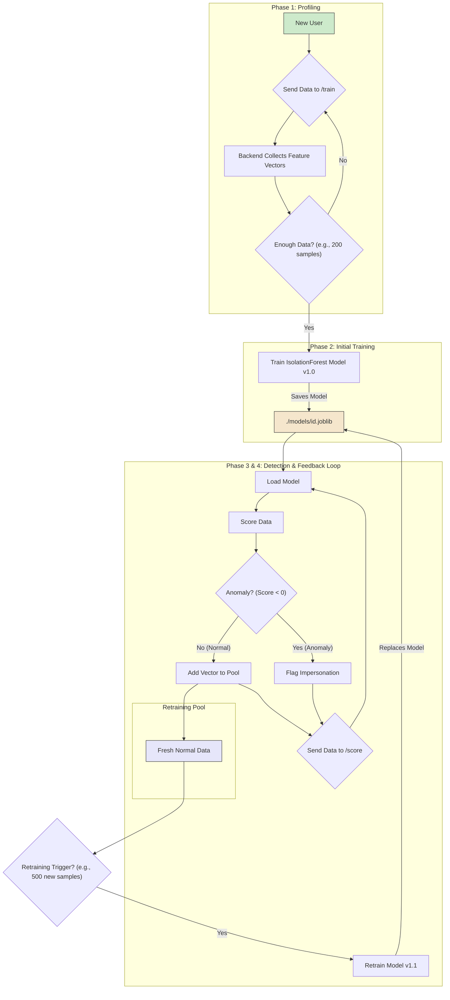

# 08. Machine Learning Model Lifecycle

---

### 1. The Core Algorithm: Isolation Forest

The entire detection system is built around Scikit-learn's `IsolationForest`. This algorithm was chosen for several critical reasons:

-   **Designed for Anomaly Detection**: It is an unsupervised algorithm that excels at identifying outliers in a dataset without needing labeled examples of "bad" behavior.
-   **No Need for Impersonator Data**: It learns the boundaries of "normal" behavior. Anything that falls outside these boundaries is flagged as an anomaly. This is perfect for our use case, as we only have access to the legitimate user's data.
-   **Efficiency**: It is computationally efficient for both training and prediction, making it suitable for a near real-time system.

### 2. The Model Lifecycle

Each user profile (`profile_id`) has its own dedicated model that progresses through a continuous, four-phase lifecycle.

#### Phase 1: Profiling (Cold Start)

This is the initial data-gathering phase for a new user.

-   **Trigger**: A new `profile_id` is created for which no model exists.
-   **Process**:
    1.  The Chrome Extension enters the `"profiling"` state.
    2.  It sends all aggregated behavioral data to the `POST /train/{profile_id}` endpoint.
    3.  The backend receives the data, runs it through the Feature Extraction engine, and stores the resulting feature vectors.
-   **Completion**: This phase ends when a predefined condition is met, such as collecting a minimum number of feature vectors (e.g., 200 data points, representing approximately 1.5 hours of active use).

#### Phase 2: Initial Training

Once the profiling phase is complete, the first version of the model is created.

-   **Trigger**: The completion of the profiling phase.
-   **Process**:
    1.  The backend gathers all the feature vectors collected during profiling.
    2.  An `IsolationForest` model is instantiated and trained (`.fit()`) on this entire dataset.
    3.  The trained model object is serialized using `joblib` and saved to the file system (e.g., `./models/{profile_id}.joblib`).
-   **Outcome**: The user's `system_state` is switched to `"detection"`. A baseline model for "normal" behavior now exists.

#### Phase 3: Detection (Active Monitoring)

This is the standard operational mode for a user with an existing model.

-   **Trigger**: The client sends data to the `POST /score/{profile_id}` endpoint.
-   **Process**:
    1.  The backend loads the user's specific model from disk.
    2.  It extracts features from the incoming JSON payload.
    3.  It uses the model's `.decision_function()` method on the new feature vector. This returns a raw anomaly score.
-   **Interpretation**:
    -   **Positive Score (e.g., `0.1`)**: The data point is similar to the training data. It is considered **normal**.
    -   **Negative Score (e.g., `-0.05`)**: The data point is an outlier. It is flagged as an **anomaly**.
    -   The `is_anomaly` flag and the raw score are returned to the client.

#### Phase 4: Retraining (The Feedback Loop)

Users' habits change over time. The model must adapt to prevent legitimate behavioral drift from being flagged as anomalous.

-   **Principle**: Only retrain on fresh, validated data. **Never retrain on data that was flagged as an anomaly.**
-   **Mechanism**:
    1.  **Data Pooling**: Every time a data point is scored as **normal** in the detection phase, its feature vector is added to a "retraining candidate pool" for that user.
    2.  **Retraining Trigger**: The backend has an internal policy to decide when to retrain. This can be:
        -   **Count-based (Recommended)**: After `N` new normal samples have been collected in the pool (e.g., `N=500`).
        -   **Time-based**: Every `X` days (e.g., `X=7`).
    3.  **Retraining Process**: When triggered, a new model is trained using a combination of the original training data and the new data from the retraining pool. This new, updated model then atomically replaces the old one on disk.
-   **Benefit**: This creates a self-improving system that stays current with the user's behavior while continuously protecting against sudden, anomalous changes.

---

### 5. Visualization

The diagram below illustrates the complete lifecycle of a single user's model.

