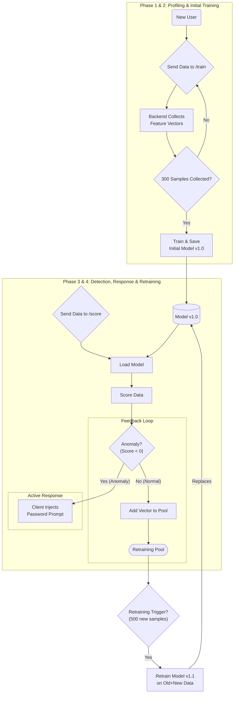

# 08. Machine Learning Model Lifecycle

This document provides a comprehensive overview of the MaxiDOM system's machine learning process, detailing the journey of a personalized model from its creation to its continuous, adaptive evolution.

---

### 1. The Core Algorithm: Isolation Forest

The entire detection system is built around Scikit-learn's `IsolationForest`. This algorithm was chosen for several critical reasons:

-   **Designed for Anomaly Detection**: It is an unsupervised algorithm that excels at identifying outliers in a dataset without needing labeled examples of "bad" behavior.
-   **No Need for Impersonator Data**: It learns the boundaries of "normal" behavior. Anything that falls outside these boundaries is flagged as an anomaly. This is perfect for our use case, as we only have access to the legitimate user's data.
-   **Efficiency**: It is computationally efficient for both training and prediction, making it suitable for a near real-time system.

### 2. The Model Lifecycle

Each user profile (`profile_id`) has its own dedicated model that progresses through a continuous, four-phase lifecycle.

#### Phase 1: Profiling (Cold Start)

This is the initial data-gathering phase for a new user, designed to build a robust foundational profile.

-   **Trigger**: A new `profile_id` is created for which no model exists.
-   **Process**: 
	1. The Chrome Extension enters the `"profiling"` state.
	2. The Chrome Extension sends all aggregated behavioral data to the `POST /train/{profile_id}` endpoint. 
	3. The backend receives the data, runs it through the Feature Extraction engine, and stores the resulting feature vectors to `training_pool`.

-   **Completion and Training Threshold**: This phase ends when a predefined number of feature vectors has been collected. For this project, the threshold is set to **300 samples**. This value was chosen systematically:
    1.  **Statistical Robustness**: It provides over 15 data points for each of the **18 features** in the model, satisfying machine learning best practices for avoiding underfitting.
    2.  **User Experience**: It corresponds to approximately **2.5 hours** of active browser usage, which is a reasonable and achievable learning period for a new user.
    
    Once the 300-sample threshold is met, the initial training phase is automatically triggered.

#### Phase 2: Initial Training

Once the profiling phase is complete, the first version of the model is created.

-   **Trigger**: The completion of the profiling phase.
-   **Process**:
    1.  A background job gathers all 300 feature vectors from the user's `training_pool`.
    2.  An `IsolationForest` model is trained (`.fit()`) on this entire dataset.
    3.  The trained model object is serialized and saved to disk (e.g., `./models/{profile_id}.joblib`).
-   **Outcome**: The foundational `training_pool` data is **permanently retained** for future retraining. The user's `system_state` is then switched to `"detection"` and a baseline model for "normal" behavior exists.

#### Phase 3: Detection and Active Response

This is the standard operational mode. The system's response bifurcates based on the model's output.

- **Trigger**:  
  The client sends behavioral data to the `POST /score/{profile_id}` endpoint.

- **Process**:  
  1. The backend loads the user's specific model from disk.
  2. Features are extracted from the incoming JSON payload and scored.
  3. The model returns a score, which determines the response path:

     - **✅ Normal Path (Score ≥ 0)**  
       - Behavior is considered **normal**.  
       - `is_anomaly` is set to `false`.  
       - The feature vector is added to the `retraining_pool` as part of the feedback loop.

     - **❗ Anomaly Path (Score < 0)**  
       - Behavior is considered **anomalous**.  
       - `is_anomaly` is set to `true`.  
       - The backend **takes no further action**.  
       - It becomes the **client’s responsibility** to initiate **step-up authentication** by prompting the user for their password.

#### Phase 4: Retraining (The Feedback Loop)

Users' habits change over time. This "concept drift" would eventually cause a static model to produce false positives. The feedback loop is an automated retraining mechanism that keeps the model current with the user's evolving behavior while maintaining stability. The system uses a **two-pool data management strategy** to achieve this.

The workflow is as follows:

1.  **Gatekeeping & Filtering**: When data from the `/score` endpoint is classified as **normal**, its feature vector is considered a trusted sample. Anomalous data is discarded and never used for retraining.

2.  **Populating the Retraining Pool**: The trusted feature vector is appended to a dedicated, temporary `retraining_pool` (e.g., `./retraining_pool/{profile_id}.csv`).

3.  **Triggering Retraining**: Retraining is triggered when the `retraining_pool` reaches a predefined size. This threshold is deliberately set higher than the initial training threshold to ensure model stability. For this project, the threshold is set to **500 new samples**.

> **Design Choice: Why a Higher Retraining Threshold?**
>
> The initial training threshold (300 samples) is designed to build a foundational profile quickly. The retraining threshold (500 samples) is designed to ensure the model only adapts to significant, sustained changes in behavior, not short-term noise. This larger data requirement provides a stronger signal of genuine concept drift and gives the model a healthy "inertia," preventing it from overreacting to temporary fluctuations.

4.  **Training the New Model**: A background job is launched to perform the following steps:
    -   **Data Combination**: The job loads data from **both** the permanent, foundational `training_pool` and the current `retraining_pool`. The two datasets are concatenated.
    -   **Training from Scratch**: A brand new `IsolationForest` model is trained on this combined dataset.
    -   **Safe Overwrite via Atomic Operation**: The old model is overwritten using a safe, atomic operation. The newly trained model is first saved to a temporary file, which is then atomically renamed to replace the old model file. This guarantees a seamless transition with no risk of a corrupted model. The old model is permanently discarded.

5.  **Completing the Cycle**: After the new model is successfully deployed, the `retraining_pool` is **cleared**. The system is now ready to begin collecting the next batch of fresh data for the next retraining cycle.

---
### Visualization

The diagram below illustrates the complete lifecycle of a single user's model.

