# 08. Machine Learning Model Lifecycle

This document details the lifecycle of the biometric models in MaxiDOM. Unlike traditional systems that use a single, evolving model, MaxiDOM employs a **Static, Multi-Modal Specialist Architecture** to ensure security integrity and reproducibility.

---

### 1. The Core Algorithm: Isolation Forest

The system uses **Scikit-learn's `IsolationForest`**. This algorithm was chosen for specific security properties:

-   **Unsupervised Learning**: It does not need "Impostor Data" to train. It learns the boundaries of the legitimate user's behavior.
-   **Anomaly Detection**: Instead of classifying "User A vs User B," it asks: *"Does this data look like it belongs to the training set?"* If not, it is an anomaly.
-   **Efficiency**: It creates a forest of random decision trees. Anomalies are isolated quickly (short path lengths), while normal data requires deeper traversal.

---

### 2. The Specialist Architecture

To solve the problem of "Partial Activity" (e.g., a user who only types but doesn't move the mouse), MaxiDOM trains **two independent models** for every user:

1.  **`model_mouse.joblib`**: Trained exclusively on sessions with significant mouse movement.
2.  **`model_typing.joblib`**: Trained exclusively on sessions with significant keystroke dynamics.

This allows the system to perform **"Dissect and Score"**: verification is performed on whichever modalities are active, without the inactive modality dragging down the score.

---

### 3. The Lifecycle Phases

#### Phase 1: Profiling (Data Collection)

This is the "Cold Start" phase. The goal is to build a diverse, high-integrity dataset.

-   **Lockdown**: The user is forced to authenticate at the start of every session to ensure data purity.
-   **Collection**: The backend extracts 15-dimensional feature vectors and stores them in `features.csv`.
-   **The Diversity Gate**: Training does not start based on a simple count. The `UserModelManager` enforces specific diversity quotas to ensure both specialist models have enough data:
    *   **Total Samples**: ≥ 300
    *   **Mouse-Active Samples**: ≥ 150
    *   **Keyboard-Active Samples**: ≥ 50
    *   **Digraph Samples**: ≥ 30

#### Phase 2: Specialist Training & Calibration

Once the Diversity Gate is passed, the backend triggers the training job:

1.  **Splitting**: The data is filtered into two subsets: one for Mouse, one for Typing.
2.  **Fitting**: An `IsolationForest` (`n_estimators=100`, `contamination=0.05`) is fitted to each subset.
3.  **Dynamic Calibration (The 15th Percentile)**:
    *   The system scores the training data against itself.
    *   It calculates the score at the **15th Percentile**.
    *   **Logic**: *"We define 'Normal' as the top 85% of the user's best behavior."*
    *   This strict threshold prioritizes security (rejecting impostors) over convenience.
4.  **Serialization**: The models and their specific thresholds are saved to `model_mouse.joblib` and `model_typing.joblib`.

#### Phase 3: Detection (The "Weakest Link" Logic)

In this active phase, the system scores new data.

1.  **Gating**: The system checks the density of the new session.
    *   If `key_count < 6`, the Typing Model **Abstains** (returns a safe score).
    *   If `mouse_count < 30`, the Mouse Model **Abstains**.
2.  **Scoring**: Valid models calculate an anomaly score.
3.  **The Verdict**:
    *   If **Mouse Score < Mouse Threshold**: **ANOMALY**.
    *   If **Typing Score < Typing Threshold**: **ANOMALY**.
    *   This enforces a "Weakest Link" policy: An impostor must pass *all* active checks to succeed.

---

### 4. Why No Retraining? (Static Security Policy)

MaxiDOM deliberately **excludes** an automated retraining/feedback loop. This is a strategic security decision.

| Risk                | Explanation                                                                                                                                                            |
| :------------------ | :--------------------------------------------------------------------------------------------------------------------------------------------------------------------- |
| **Model Poisoning** | If the system retrains on data it *thinks* is normal (but is actually a clever impostor), the model learns to accept the attack.                                       |
| **Concept Drift**   | Users tend to become "lazier" over time. Automated retraining dilutes the strict baseline established during the pristine Profiling phase, increasing False Positives. |
| **Determinism**     | For forensic and auditing purposes, the security rules must be fixed. A static model guarantees that the same input always produces the same output.                   |

**Defense Narrative:**
> *"We prioritized **Security Integrity** over adaptive convenience. By locking the model after the verified Profiling phase, we prevent adversarial drift and ensure the security baseline remains uncompromised."*

---

### 5. Lifecycle Diagram

```mermaid
graph TD
    subgraph "Phase 1: Profiling"
        Data[Incoming Data] --> CSV[(features.csv)]
        CSV --> Check{Diversity Met? - 300 total, 50 keys, 150 mouse}
        Check -- "No" --> Wait[Continue Collection]
    end

    subgraph "Phase 2: Training"
        Check -- "Yes" --> Split[Split Data]
        Split --> TrainM[Train Mouse Model]
        Split --> TrainK[Train Typing Model]
        TrainM --> CalibM[Calibrate 15th Percentile]
        TrainK --> CalibK[Calibrate 15th Percentile]
        CalibM & CalibK --> Save[(Save Models)]
    end

    subgraph "Phase 3: Detection"
        Live[Live Session] --> Gate{Significance Gate}
        Gate -- "Valid Data" --> Score[Score against Specialists]
        Score --> Threshold{Score < 15th %?}
        Threshold -- "Yes" --> Alert[🚨 ANOMALY = Lockdown]
        Threshold -- "No" --> Pass[✅ Normal]
    end
```

